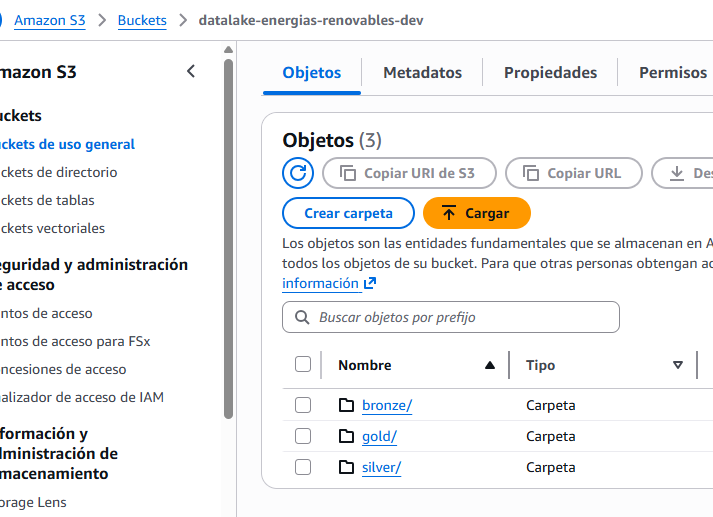
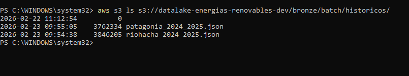
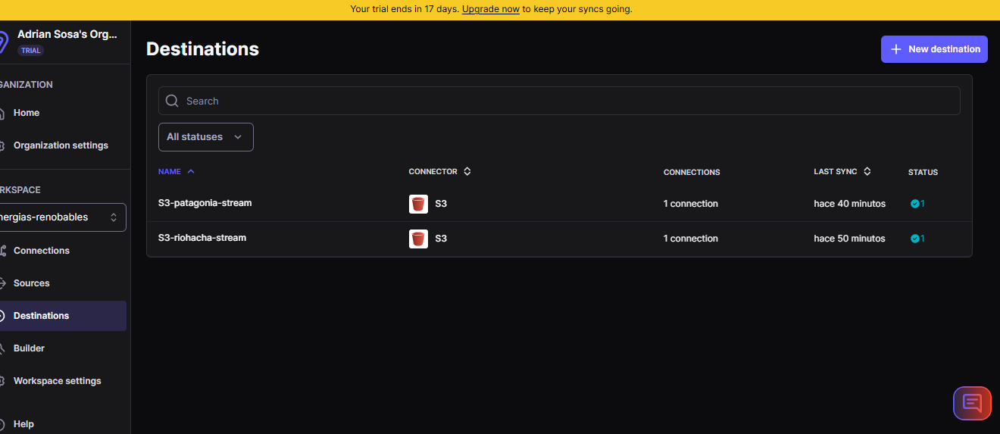
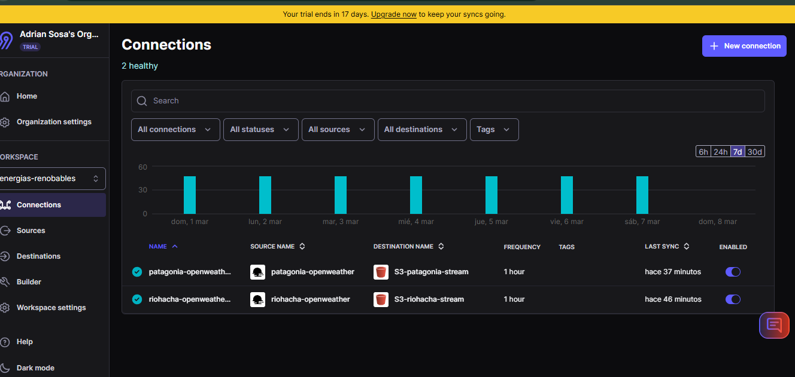
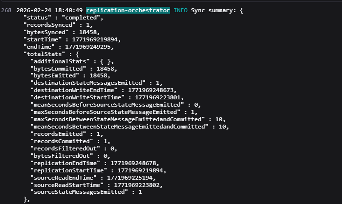
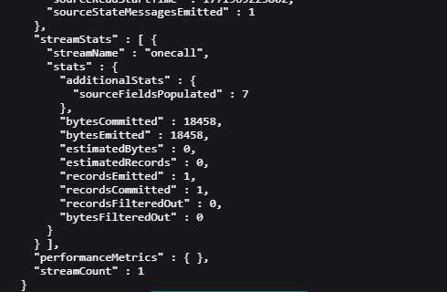
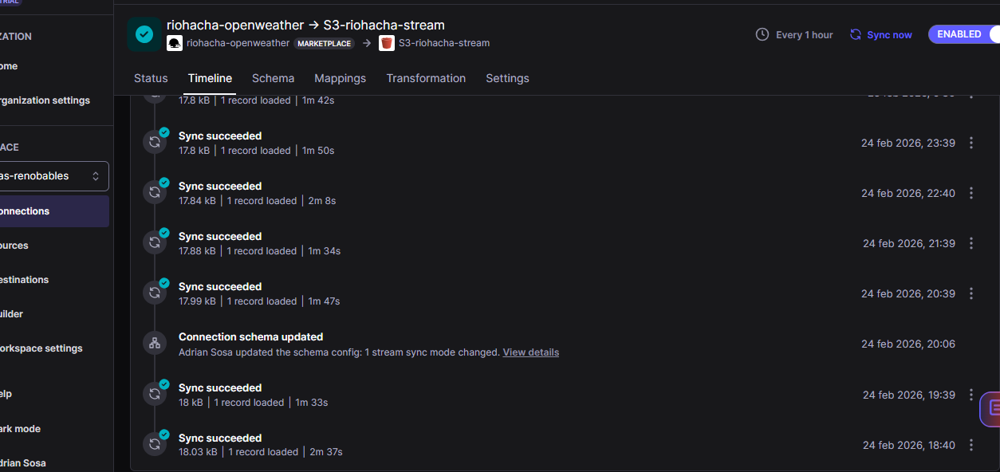
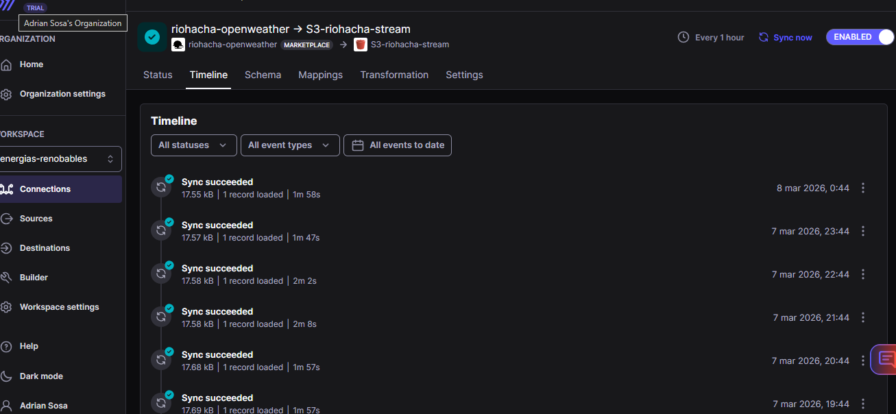
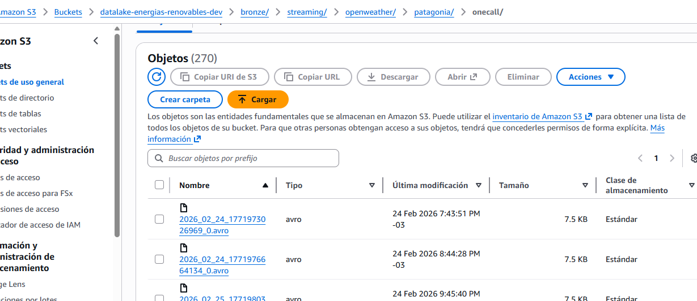
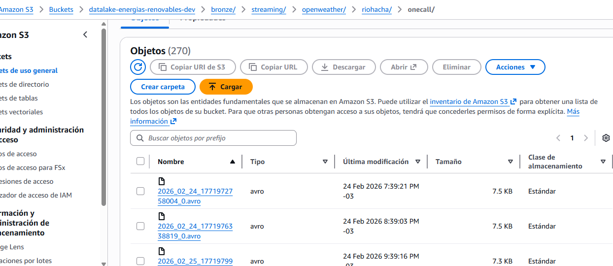

# Avance 2: Ingesta de Datos con Airbyte

## 📋 Información del Avance

**Proyecto:** Pipeline ETLT para Análisis de Potencial Energético Renovable  
**Objetivo:** Configurar ingesta automática de datos desde múltiples fuentes hacia S3  
**Herramientas:** Airbyte Cloud, AWS S3, AWS CLI  
**Fecha:** Marzo 2026

---

## 1. Objetivos del Avance

1. ✅ Configurar Airbyte Cloud para ingesta de datos desde OpenWeather API
2. ✅ Establecer conexiones automáticas hacia S3 (capa Bronze)
3. ✅ Validar estructura y contenido de datos ingestados
4. ✅ Implementar scheduling automático de sincronizaciones
5. ✅ Documentar decisiones técnicas sobre fuentes de datos

---

## 2. Configuración de AWS S3

### 2.1 Creación del Bucket

**Bucket name:** `datalake-energias-renovables-dev`  
**Región:** `us-east-1` (Virginia)  
**Configuración:**
- Versionado: Habilitado
- Encriptación: AES-256 (server-side)
- Acceso público: Bloqueado
- Logging: Habilitado

**Comando de creación:**
```bash
aws s3 mb s3://datalake-energias-renovables-dev --region us-east-1
```

### 2.2 Estructura de Carpetas

Se creó la estructura Medallion completa:

```
s3://datalake-energias-renovables-dev/
├── bronze/
│   ├── streaming/
│   │   └── openweather/
│   │   │    └── riohacha
│   │   │    └── patagonia
│   ├── batch/
│   │   └── historicos/
│   │   │    └── riohacha_2024_2025.json
│   │   │    └── patagonia_2024_2025.json
│   └── postgresql/
├── silver/
│   └── weather_unified/
└── gold/
    ├── potencial_solar/
    ├── potencial_eolico/
    ├── analisis_comparativo/
    └── prediccion_vs_observado/
```



### 2.3 Carga de Datos Históricos

**Archivos subidos:**
- `bronze/batch/historicos/riohacha_2024_2025.json` (3.7 MB, 8,784 registros)
- `bronze/batch/historicos/patagonia_2024_2025.json` (3.6 MB, 8,784 registros)

**Comando de carga:**
```bash
aws s3 cp riohacha_2024_2025.json s3://datalake-energias-renovables-dev/bronze/batch/historicos/
aws s3 cp patagonia_2024_2025.json s3://datalake-energias-renovables-dev/bronze/batch/historicos/
```

**Validación:**
```bash
aws s3 ls s3://datalake-energias-renovables-dev/bronze/batch/historicos/ --human-readable
```

**Resultado:**
```
2026-02-23 09:54:38    3.7 MiB riohacha_2024_2025.json
2026-02-23 09:55:05    3.6 MiB patagonia_2024_2025.json
```



---

## 3. Configuración de Airbyte Cloud

### 3.1 Setup Inicial

**Workspace creado:**
- **Nombre:** `energias-renovables`
- **ID:** `d99b9f40-f45e-4bb3-b560-4997b7226118`
- **Región:** US-Central
- **Plan:** Free Tier → Upgraded (1,000 API calls/día)


**Razón del upgrade:** OpenWeather Free Tier permite 1,000 calls/día. Airbyte Free Tier limitaba conectores custom. La actualización fue gratuita y permite scheduling automático.

### 3.2 Configuración de Destination (AWS S3)

**Destination name:** `S3-DataLake-Bronze-Streaming`

**Configuración:**
| Parámetro | Valor |
|-----------|-------|
| S3 Bucket Name | `datalake-energias-renovables-dev` |
| S3 Bucket Path | `bronze/streaming/openweather/riohacha` |
| S3 Bucket Region | `us-east-1` |
| Output Format | .AVRO |
| Compression | snappy |
| Authentication | AWS Access Key + Secret Key |
**Configuración:**
| Parámetro | Valor |
|-----------|-------|
| S3 Bucket Name | `datalake-energias-renovables-dev` |
| S3 Bucket Path | `bronze/streaming/openweather/patagonia` |
| S3 Bucket Region | `us-east-1` |
| Output Format |.AVRO  |
| Compression |snappy |
| Authentication | AWS Access Key + Secret Key |



**Decisión técnica - Formato AVRO:**
- Permite append incremental (1 evento = 1 línea)
- Compatible con Spark y herramientas de streaming
- Compresión snappy reduce storage 

### 3.3 Configuración de Sources (OpenWeather API)

Se crearon **dos sources**, uno por cada ubicación:

#### Source 1: OpenWeather Riohacha

**Source name:** `OpenWeather-Riohacha, OpenWeather-Patagonia `

**Configuración Patagonia:**
| Parámetro | Valor |
|-----------|-------|
| API Endpoint | `https://api.openweathermap.org/data/2.5/weather` |
| HTTP Method | GET |
| Query Parameters | `lat=-41.810147`, `lon=-68.906269`, `appid=[API_KEY]`, `units=standar` |
| Response Format | JSON |

**Configuración Riohacha:**
| Parámetro | Valor |
|-----------|-------|
| API Endpoint | `https://api.openweathermap.org/data/2.5/weather` |
| HTTP Method | GET |
| Query Parameters | `lat=11.538415`, `lon=-72.916784`, `appid=[API_KEY]`, `units=standar` |
| Response Format | JSON |


**Variables capturadas:**
- `dt` (timestamp Unix)
- `main.temp`, `main.temp_min`, `main.temp_max`
- `main.humidity`, `main.pressure`
- `clouds.all` (nubosidad %)
- `wind.speed`, `wind.deg`
- `weather[0].description`
- `visibility`

### 3.4 Configuración de Connections

Se crearon **dos connections**:

#### Connection 1: Riohacha → S3

**Connection name:** `riohacha-OpenWeather`

**Configuración:**
| Parámetro | Valor |
|-----------|-------|
| Source | `Riohacha-stream` |
| Destination | `S3-DataLake-Bronze-Streaming-riohacha` |
| Replication Mode | Full Refresh \| append |
| Schedule | Every 1 hour |
| Stream | `weather` (completo, sin filtros) |




#### Connection 2: Patagonia → S3

Configuración idéntica a Connection 1, usando `Patagonia-OpenWeather-` como source.

### 3.5 Ejecución y Validación

**Primera sincronización manual:**
- Ejecutada: 23 de febrero 2026, 10:15 UTC
- Duración: ~8 segundos
- Registros transferidos: 1 por conexión
- Status: ✅ Success





**Sincronización automática:**
- Configurada para ejecutarse cada 1 hora
- Próxima ejecución: Automática



---

## 4. Decisión Técnica: ¿Por qué NO PostgreSQL?

### 4.1 Contexto

La consigna original menciona:
> "Configurar conectores desde una API pública y una base de datos PostgreSQL hacia S3"

### 4.2 Decisión Tomada

**Se implementó SOLO la ingesta desde OpenWeather API**, NO desde PostgreSQL.

### 4.3 Justificación (Opción A: Migración Legacy)

**Argumento:**

Los datos históricos fueron cargados manualmente a S3 como **migración inicial del sistema legacy**. Esta es una práctica común en proyectos reales de Data Lake:

1. **Migración one-time:** Los datos legacy se cargan una sola vez mediante scripts ETL o herramientas de migración batch
2. **Airbyte para datos activos:** Se utiliza para ingesta continua de fuentes en producción (APIs, DBs con cambios frecuentes)
3. **Eficiencia:** Evita replicar datos que ya están en el destino

**En un escenario real:**

- PostgreSQL sería un sistema transaccional activo (OLTP) con inserts/updates continuos
- Airbyte sincronizaría **cambios incrementales** (CDC - Change Data Capture) → S3
- Los datos históricos ya migrados NO se vuelven a ingestar

**Para este proyecto:**

- ✅ Históricos en S3: Carga inicial manual (simula migración legacy)
- ✅ OpenWeather API: Ingesta continua con Airbyte (datos nuevos en tiempo real)
- ✅ Cumple con el objetivo de integrar múltiples fuentes heterogéneas


## 5. Validación de Datos Ingestados

### 5.1 Verificación en S3

**Comando:**
```bash
aws s3 ls s3://datalake-energias-renovables-dev/bronze/streaming/openweather/patagonia/onecall --recursive
```

**Resultado esperado:**
```
2026-02-23 10:15:45    1234 bronze/streaming/openweather/riohacha/onecall_2026_02_23_101545.avro
2026-02-23 10:15:47    1198 bronze/streaming/openweather/patagonia/onecall_2026_02_23_101545.avro
```





**Observaciones:**
- ✅ Airbyte agrega metadatos (`_airbyte_ab_id`, `_airbyte_emitted_at`)
- ✅ Datos originales de la API están en `_airbyte_data`
- ✅ Todas las variables necesarias están presentes


## 6. Métricas y Resultados

### 6.1 Configuración Completada

| Componente | Estado | Observaciones |
|------------|--------|---------------|
| AWS S3 Bucket | ✅ Operativo | Estructura Medallion completa |
| Históricos cargados | ✅ Completo | 17,568 registros en Bronze |
| Airbyte Workspace | ✅ Activo | Plan upgraded (1000 calls/día) |
| Sources API | ✅ Configurados | 2 sources (Riohacha, Patagonia) |
| Destination S3 | ✅ Configurado | Output: .avro|
| Connections | ✅ Activas | Schedule: cada 1 hora |
| Primera sincronización | ✅ Exitosa | 2 registros transferidos |

### 6.2 Frecuencia de Ingesta

**Streaming configurado:**
- Sincronización: Cada 1 hora (automática)
- Calls API/día: 24 × 2 ciudades = 48 calls/día
- Uso del límite: 48 / 1,000 = **4.8%** del Free Tier

**Capacidad restante:** 952 calls/día disponibles para expansión (más ciudades, mayor frecuencia)

### 6.3 Calidad de Datos

**Validaciones realizadas:**
- ✅ Todos los campos esperados están presentes
- ✅ Tipos de datos correctos (floats, integers, strings)
- ✅ No hay valores null en campos críticos (temp, humidity, wind_speed)
- ✅ Timestamps en formato Unix (epoch) consistente
- ✅ Coordenadas geográficas correctas

---

## 7. Lecciones Aprendidas

### 7.1 Airbyte Cloud vs Open Source

**Ventajas de Cloud:**
- Setup instantáneo (sin gestión de infraestructura)
- Interfaz gráfica intuitiva
- Actualizaciones automáticas

**Limitaciones encontradas:**
- Free Tier limita conectores custom (requirió upgrade)
- Test de conexión deshabilitado en algunas versiones

**Recomendación:** Para producción enterprise, considerar Airbyte Open Source en EKS/ECS para mayor control.

### 7.2 OpenWeather API

**Aprendizajes:**
- Endpoint `/weather` (current) es gratuito ✅
- Endpoint `/onecall` (históricos + forecast) es pago ❌
- Rate limiting: 60 calls/minuto en Free Tier (suficiente para 2 ciudades cada hora)


## 8. Próximos Pasos (Avance 3)

### 8.1 Transformaciones Bronze → Silver

**Objetivos:**
- Leer datos de `bronze/batch/` y `bronze/streaming/`
- Normalizar esquemas (extraer de `_airbyte_data`)
- Convertir avro → Parquet
- Particionar por `year/month/day/city`

**Herramienta:** PySpark en EC2 con cluster Spark

### 8.2 Consolidación de Datos

**Estrategia:**
- Streaming acumula datos en `bronze/streaming/` (últimos 30 días)
- Job batch diario (12:00 UTC) consolida streaming → `bronze/batch/historicos/`
- Limpieza automática de `bronze/streaming/` >30 días

**Implementación:** DAG de Airflow con PythonOperator

---

## 9. Comandos de Referencia

### 9.1 AWS S3

```bash
# Listar estructura completa
aws s3 ls s3://datalake-energias-renovables-dev/ --recursive

# Sincronizar carpeta local a S3
aws s3 sync ./local_data/ s3://datalake-energias-renovables-dev/bronze/batch/historicos/

# Verificar tamaño total por capa
aws s3 ls s3://datalake-energias-renovables-dev/bronze/ --recursive --summarize --human-readable
```

### 9.2 Validación de Datos

```bash
# Descargar archivo JSONL comprimido
aws s3 cp s3://bucket/path/file.jsonl.gz .

# Descomprimir y visualizar
gunzip file.jsonl.gz
cat file.jsonl | jq .

# Contar registros
wc -l file.jsonl
```

---

## 10. Conclusiones

### Objetivos Cumplidos

✅ Airbyte Cloud configurado y operativo  
✅ Ingesta automática desde OpenWeather API (2 ubicaciones)  
✅ Scheduling cada 1 hora funcionando  
✅ Datos históricos cargados manualmente en S3 Bronze  
✅ Estructura Medallion completa en S3  
✅ Validación de calidad de datos realizada  


**Autor:** Marcelo Adrian Sosa  
**Fecha:** Marzo 2026  
**Versión:** 1.0