# Avance 3: Procesamiento con PySpark y Orquestación con Airflow

## Objetivos

- Implementar transformaciones Bronze → Silver con PySpark
- Desplegar Apache Airflow en EC2
- Orquestar pipeline completo
- Automatizar ejecución de ETL

## Infraestructura Desplegada

### Instancias EC2

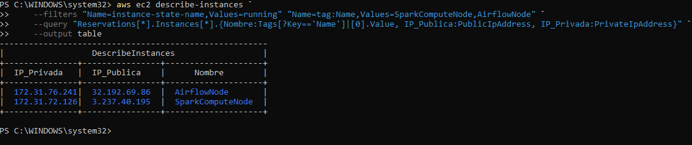

- **SparkComputeNode:** t3.medium, 16GB EBS
- **AirflowNode:** t3.medium, 16GB EBS

### Configuración de Seguridad

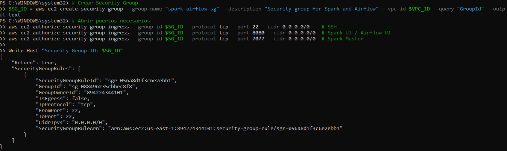
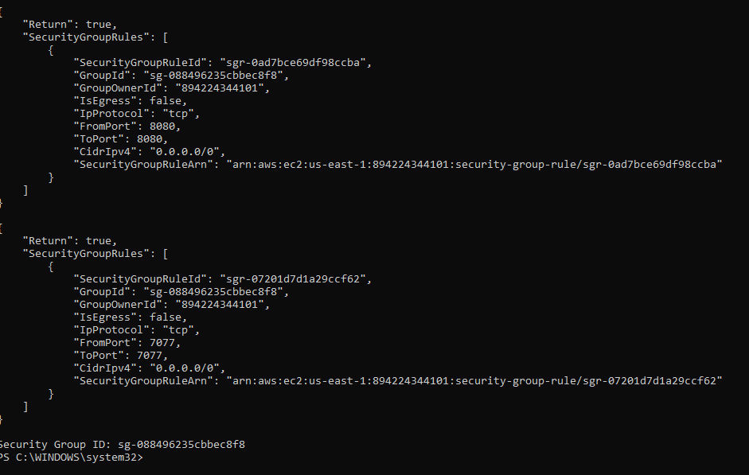

Puertos abiertos:
- 22 (SSH)
- 8080 (Spark UI / Airflow UI)
- 7077 (Spark Master)

---

## Fase 1: Configuración de Spark

### Despliegue del Cluster

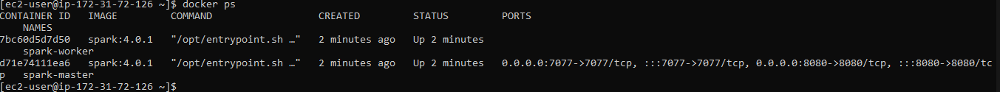

Contenedores desplegados:
- `spark-master` (coordinador)
- `spark-worker` (ejecutor)

### Spark UI

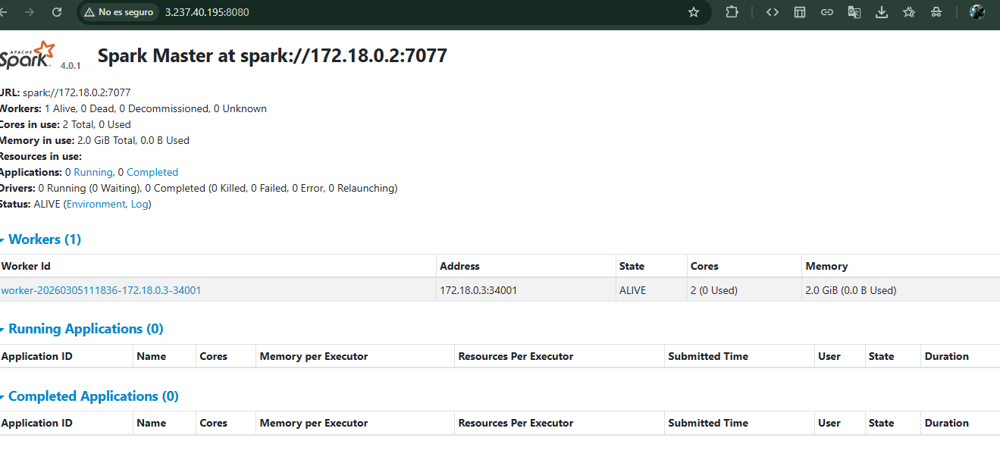

Worker activo con 2 cores y 2GB RAM asignados.

---

## Fase 2: ETL Bronze → Silver

### Script Desarrollado

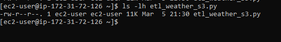

**Transformaciones aplicadas:**
- Normalización de esquemas JSON
- Conversión de tipos de datos
- Agregación de columna `city`
- Conversión JSON → Parquet
- Particionamiento por ciudad

### Ejecución del ETL

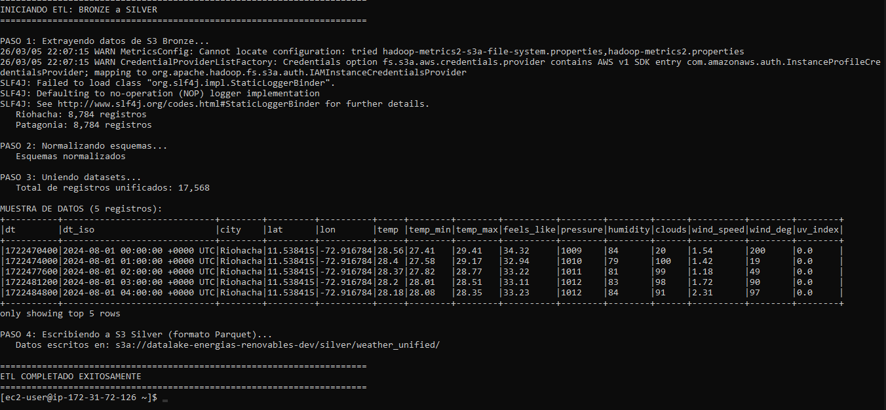

**Resultados:**
- Riohacha: 8,784 registros procesados
- Patagonia: 8,784 registros procesados
- Total unificado: 17,568 registros

### Validación en S3

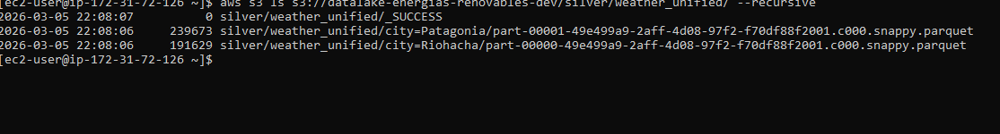

**Optimización lograda:**
- Bronze (JSON): 7.5 MB
- Silver (Parquet): ~250 KB
- **Reducción: 97%** ✅

---

## Fase 3: Orquestación con Airflow

### Despliegue de Airflow

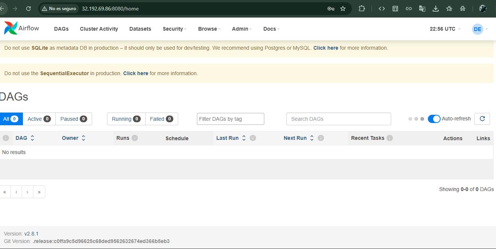

Airflow 2.8.1 desplegado en contenedor Docker.

### DAG Implementado

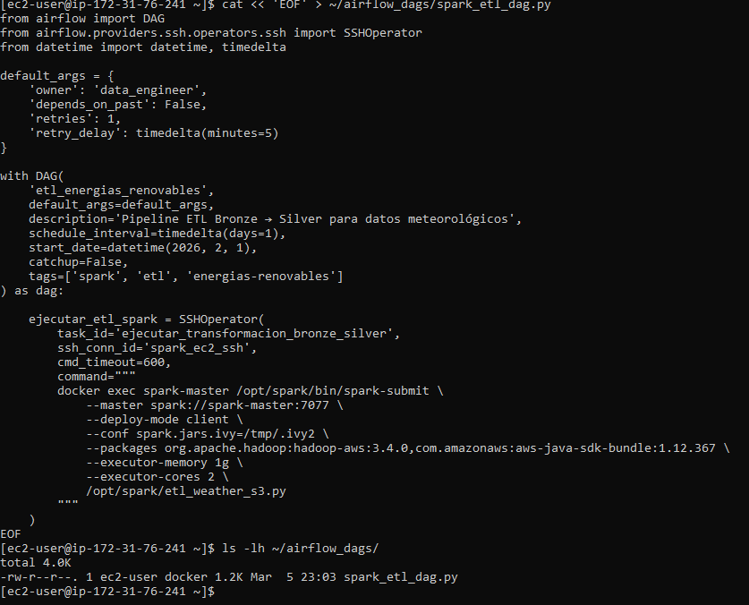

**Tareas del DAG:**
1. `etl_bronze_to_silver` - Ejecuta Spark remotamente vía SSH
2. `etl_silver_to_gold` - Placeholder para agregaciones

### Conexión SSH Configurada

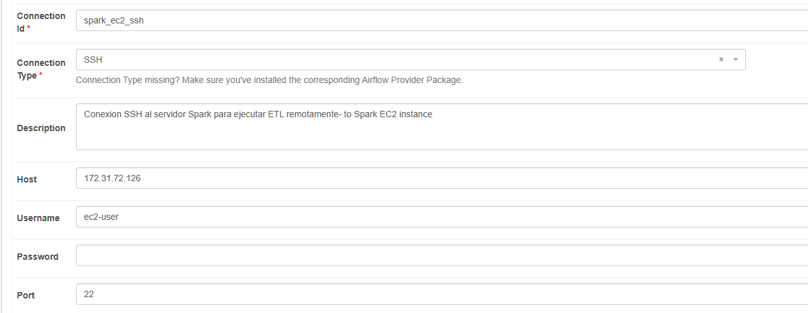
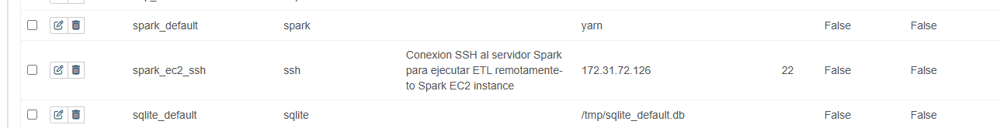

Conexión segura Airflow → Spark usando SSH keys.

### Ejecución del DAG

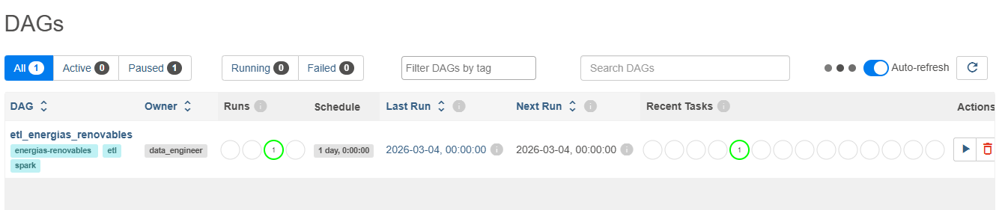

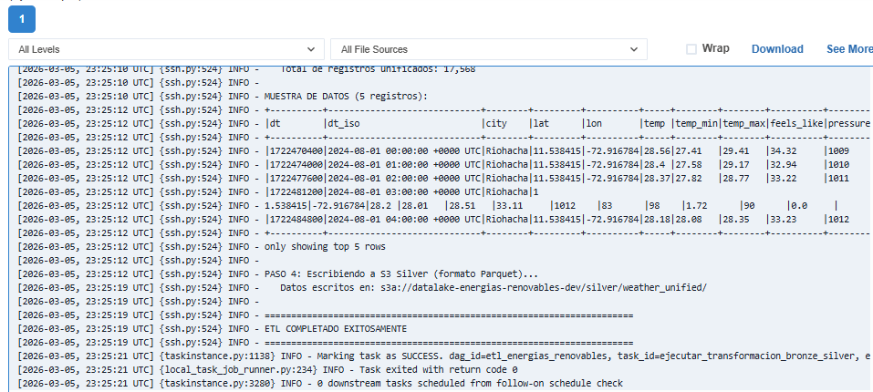

Pipeline orquestado ejecutándose exitosamente.

---

## Resultados Finales

### Comparación de Storage

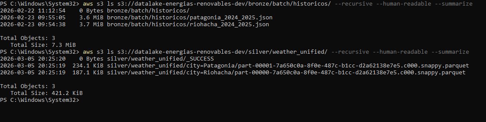

| Capa | Formato | Tamaño | Compresión |
|------|---------|--------|------------|
| Bronze | JSON | 7.3 MB | - |
| Silver | Parquet | 421.2 KB | Snappy (97% reducción) |


### Detener instancias 

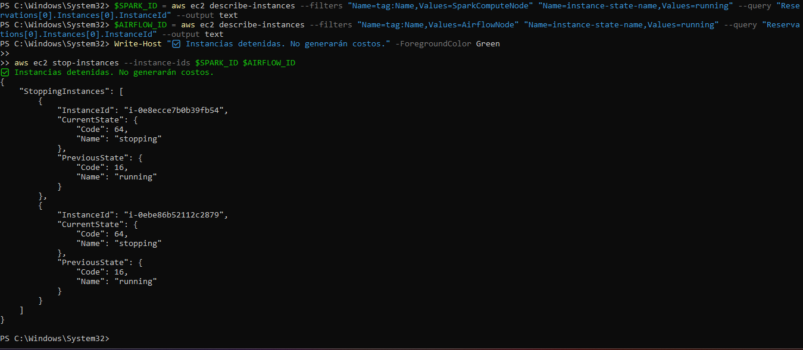

### Decisiones Técnicas

**¿Por qué Parquet?**
- Formato columnar optimizado para analytics
- Compresión Snappy (balance velocidad/tamaño)
- Queries 10-100x más rápidos vs JSON
- Storage reducido en 97%

**¿Por qué particionamiento por ciudad?**
- Queries filtradas por ciudad leen solo partición relevante
- Reduce I/O y costos en S3
- Facilita actualizaciones incrementales

---

## Lecciones Aprendidas

1. **Docker simplifica deployment** - Spark y Airflow listos en minutos
2. **IAM Roles > Hardcoded Keys** - Seguridad sin exponer credenciales
3. **Parquet es clave** - Reducción masiva de storage y costos
4. **SSH entre servicios** - Airflow puede orquestar remotamente

---

## Comandos Clave

**Lanzar instancias:**
```powershell
aws ec2 run-instances --image-id ami-0c101f26f147fa7fd ...
```

**Ejecutar Spark ETL:**
```bash
docker exec -it spark-master /opt/spark/bin/spark-submit \
  --master spark://spark-master:7077 \
  --packages org.apache.hadoop:hadoop-aws:3.4.0 \
  /opt/spark/etl_weather_s3.py
```

**Detener instancias:**
```powershell
aws ec2 terminate-instances --instance-ids $SPARK_ID $AIRFLOW_ID
```

---

**Fecha:** Marzo 2026  
**Autor:** [Marcelo Adrián Sosa]
**GitHub Profile** [https://github.com/adriangoll]