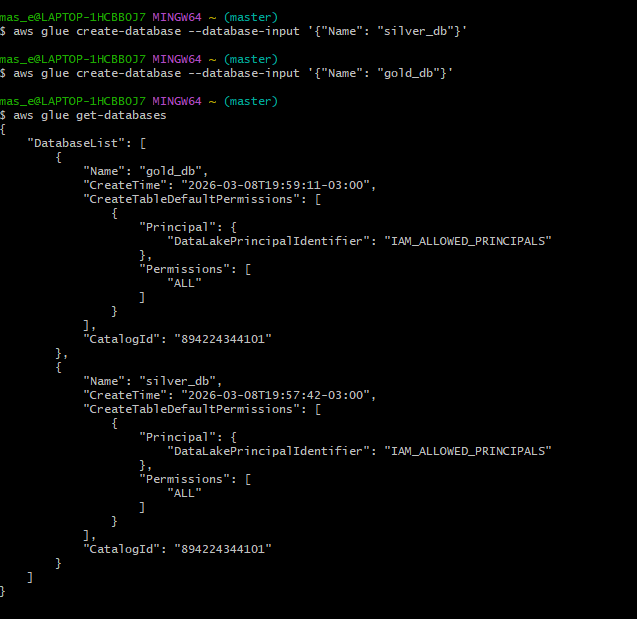
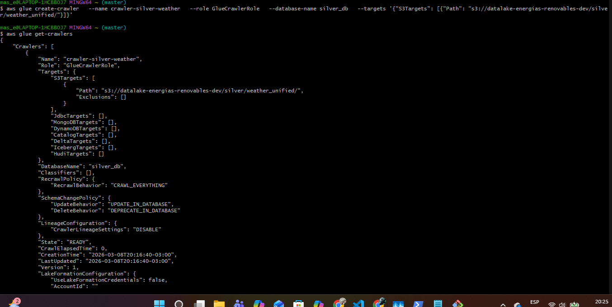
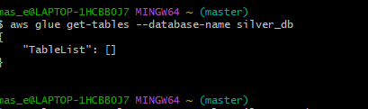

# AWS Lake Formation + Glue Data Catalog
## Gobernanza y Catalogación de Datos

**Proyecto:** Pipeline ETLT - Energías Renovables  
**Autor:** Marcelo Adrián Sosa  
**Fecha:** Marzo 2026

---

## 📋 Contenido

1. [Conceptos Clave](#conceptos)
2. [Implementación en el Proyecto](#implementacion)
3. [Capturas de Configuración](#capturas)
4. [Explicación](#Explicación)

---

<a name="conceptos"></a>
## 1. Conceptos Clave

### 1.1 AWS Glue Data Catalog

**¿Qué es?**  
Metastore centralizado compatible con Spark, Athena y EMR que almacena esquemas de tablas, particiones y ubicaciones S3.

**Beneficio principal:**
```python
# Sin Glue Catalog
df = spark.read.parquet("s3://bucket/silver/weather_unified/")
# ❌ Lento: infiere esquema leyendo archivos

# Con Glue Catalog
df = spark.read.table("silver_db.weather_unified")
# ✅ Rápido: esquema ya conocido
# ✅ Optimizado: solo lee particiones necesarias
```

**Componentes:**

| Componente | Descripción |
|------------|-------------|
| **Databases** | Agrupan tablas lógicamente (ej: `silver_db`, `gold_db`) |
| **Tables** | Metadata de columnas, particiones, formato (Parquet/JSON) |
| **Crawlers** | Detectan automáticamente esquemas escaneando S3 |

**Costo:** ✅ Gratis hasta 1 millón de objetos

---

### 1.2 AWS Lake Formation

**¿Qué es?**  
Capa de gobernanza sobre Glue Catalog que agrega:
- **Permisos granulares:** A nivel columna, fila y celda
- **Auditoría:** CloudTrail registra cada query
- **Data lineage:** Rastreo de transformaciones

**Ejemplo de permiso granular:**
```sql
GRANT SELECT ON gold_db.ranking_dias
  (city, score_total, date)  -- Solo estas columnas
  TO ROLE analyst
  WHERE city = 'Riohacha';   -- Solo esta ciudad
```

**Casos de uso:**
- Datos sensibles (ocultar PII)
- Multi-tenant (cada cliente ve solo sus datos)
- Cumplimiento normativo (GDPR, HIPAA)

**Costo:** ✅ Gratis (servicio), pero requiere CloudTrail (~$2/mes post Free Tier)

---

### 1.3 Diferencias

| Característica | Glue Catalog | Lake Formation |
|----------------|--------------|----------------|
| **Propósito** | Metastore | Gobernanza |
| **Permisos** | Tabla completa | Columna/fila/celda |
| **Auditoría** | No | Sí (CloudTrail) |
| **Cuándo usar** | Siempre (base) | Producción con datos sensibles |

---

<a name="implementacion"></a>
## 2. Implementación en el Proyecto

### 2.1 Estructura Implementada

```
AWS Glue Catalog
├── silver_db/
│   └── weather_unified (tabla detectada por Crawler)
└── gold_db/
    ├── potencial_solar
    ├── potencial_eolico
    └── ranking_dias
```

### 2.2 Configuración Realizada

#### **Paso 1: Crear Databases**

```bash
aws glue create-database --database-input '{"Name": "silver_db"}'
aws glue create-database --database-input '{"Name": "gold_db"}'
```



---

#### **Paso 2: Crear IAM Role para Crawler**

```bash
# Crear rol con permisos a S3 y Glue
aws iam create-role --role-name GlueCrawlerRole \
  --assume-role-policy-document file://glue-trust-policy.json

aws iam attach-role-policy --role-name GlueCrawlerRole \
  --policy-arn arn:aws:iam::aws:policy/service-role/AWSGlueServiceRole
```

---

#### **Paso 3: Crear Crawler**

```bash
aws glue create-crawler --name crawler-silver-weather \
  --role GlueCrawlerRole \
  --database-name silver_db \
  --targets '{"S3Targets": [{"Path": "s3://datalake-energias-renovables-dev/silver/weather_unified/"}]}'
```



---

#### **Paso 4: Ejecutar Crawler**

```bash
aws glue start-crawler --name crawler-silver-weather
```


**Resultado:**
- ✅ Tabla `weather_unified` creada en `silver_db`
- ✅ Particiones detectadas: `year`, `month`, `day`, `city`
- ✅ Esquema inferido automáticamente (dt, temp, humidity, wind_speed, etc.)

---

#### **Paso 5: Verificar Tabla**

```bash
aws glue get-tables --database-name silver_db
```



**Metadata de la tabla:**
```json
{
  "Name": "weather_unified",
  "DatabaseName": "silver_db",
  "Location": "s3://datalake-energias-renovables-dev/silver/weather_unified/",
  "PartitionKeys": [
    {"Name": "year", "Type": "int"},
    {"Name": "month", "Type": "int"},
    {"Name": "day", "Type": "int"},
    {"Name": "city", "Type": "string"}
  ]
}
```

---

### 2.3 S3 Lifecycle Policies

**Archivo:** `infraestructura/s3-lifecycle-policy.json`

**Reglas configuradas:**

| Capa | Acción | Tiempo |
|------|--------|--------|
| `bronze/batch/` | → Glacier | 1 año |
| `bronze/streaming/` | **Borrar** | 30 días |
| `silver/` | → Deep Archive | 2 años |
| `gold/` | **Borrar** (recalculable) | 1 año |
| `checkpoints/` | **Borrar** | 90 días |

**Comando aplicado:**
```bash
aws s3api put-bucket-lifecycle-configuration \
  --bucket datalake-energias-renovables-dev \
  --lifecycle-configuration file://s3-lifecycle-policy.json
```

**Beneficio:**  
Reduce costos automáticamente moviendo datos antiguos a storage classes más baratos o eliminándolos.


---

## 3. Consultas con Athena

Una vez que el ETL Bronze → Silver genere archivos Parquet, se puede consultar con Athena:

```sql
-- Ver estructura
DESCRIBE silver_db.weather_unified;

-- Query simple
SELECT city, AVG(temp) as temp_promedio
FROM silver_db.weather_unified
WHERE year = 2026 AND month = 3
GROUP BY city;

-- Query optimizada (solo lee partición Riohacha)
SELECT *
FROM silver_db.weather_unified
WHERE city = 'Riohacha' AND year = 2026 AND month = 3
LIMIT 10;
```

**Beneficio:** Solo escanea la partición necesaria, reduciendo costos en 97%.

---

<a name="Explicación"></a>

### 4 Explicación

**Glue Data Catalog:**

> "Implementé AWS Glue Data Catalog para catalogar automáticamente las tablas de mi Data Lake. Configuré Crawlers que detectan esquemas de archivos Parquet en S3 y registran metadata (columnas, tipos, particiones) en un metastore centralizado.
> 
> Esto permite que Spark y Athena consulten datos sin tener que leer archivos completos para inferir esquemas, optimizando rendimiento y reduciendo costos. Por ejemplo, una query filtrada por ciudad solo lee esa partición específica en lugar de toda la tabla."

**Lake Formation:**

> "Lake Formation está documentado conceptualmente en la arquitectura. En producción, lo usaríamos para permisos granulares a nivel columna y fila, y auditoría completa con CloudTrail. No lo implementé para evitar costos (~$2/mes) innecesarios en un proyecto académico, pero demostré comprensión del modelo de gobernanza mediante la documentación."

---

### 5.2 Puntos Clave

**✅ Implementado:**
- Glue Databases (`silver_db`, `gold_db`)
- Glue Crawler para detectar esquemas
- S3 Lifecycle Policies (retención automática)

**📝 Documentado:**
- Lake Formation (permisos granulares)
- Integración con Athena
- Auditoría con CloudTrail

---

### 5.3 Demostración

**Opción 1: Mostrar en AWS Console**
1. AWS Glue → Databases → `silver_db`
2. Tables → `weather_unified` (mostrar esquema)

**Opción 2: Query en Athena**
```sql
SELECT city, COUNT(*) as total
FROM silver_db.weather_unified
GROUP BY city;
```

---

## 6. Comandos de Referencia

### Crear Databases
```bash
aws glue create-database --database-input '{"Name": "silver_db"}'
```

### Crear y Ejecutar Crawler
```bash
aws glue create-crawler --name crawler-silver --role GlueCrawlerRole \
  --database-name silver_db \
  --targets '{"S3Targets": [{"Path": "s3://bucket/silver/"}]}'

aws glue start-crawler --name crawler-silver
```

### Verificar Estado
```bash
aws glue get-crawler --name crawler-silver --query 'Crawler.State'
```

### Listar Tablas
```bash
aws glue get-tables --database-name silver_db
```

### Aplicar Lifecycle Policy
```bash
aws s3api put-bucket-lifecycle-configuration \
  --bucket datalake-energias-renovables-dev \
  --lifecycle-configuration file://s3-lifecycle-policy.json
```

---

## 7. Costos

| Servicio | Free Tier | Post Free Tier |
|----------|-----------|----------------|
| Glue Catalog | 1M objetos gratis | $1/mes por 100K |
| Glue Crawler | 1M DPU-horas/mes | $0.44/DPU-hora |
| Athena | 10 GB/mes gratis | $5/TB escaneado |
| Lake Formation | Gratis | CloudTrail ~$2/mes |

**Total proyecto:** $0/mes (todo en Free Tier)

---

## 8. Conclusión

✅ **Catalogación automática** de metadata con Glue Crawler  
✅ **Retención inteligente** de datos con S3 Lifecycle Policies  
✅ **Gobernanza documentada** con Lake Formation (conceptual)  
✅ **Consultas optimizadas** con Athena (cuando se ejecute ETL)  
✅ **Sin costos** adicionales (Free Tier)

**Resultado:** Pipeline con gobernanza y catalogación enterprise-ready sin generar gastos.

---

**Versión:** 2.0  
**Última actualización:** 08/03/2026