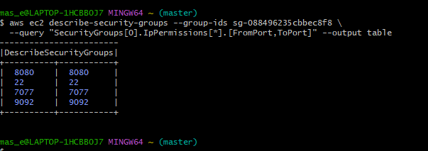
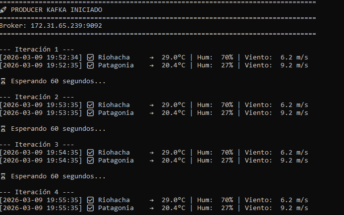
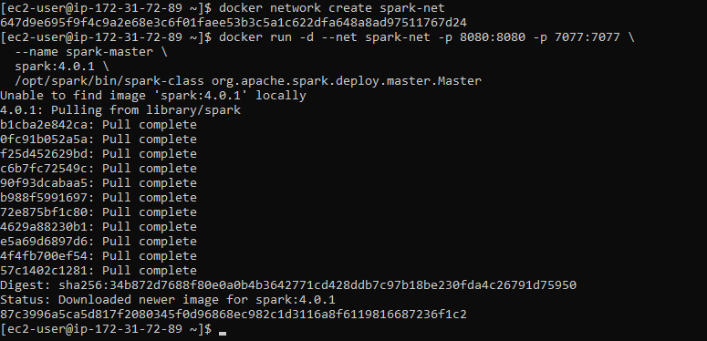

# Avance 6: Streaming con Apache Kafka

**Proyecto:** Pipeline ETLT - Energías Renovables  
**Autor:** Marcelo Adrián Sosa  
**Fecha:** Marzo 2026

---

## 📋 Objetivo

Implementar pipeline de streaming en tiempo real con Apache Kafka que:
- Consulta OpenWeather API cada 60 segundos
- Envía datos a topics diferenciados por ciudad
- Spark Structured Streaming consume y escribe a S3 Bronze
- Se integra con pipeline batch existente

---

## 🏗️ Arquitectura Implementada

```
OpenWeather API
      ↓
  Producer (Python)
      ↓
Apache Kafka
├── weather_riohacha
└── weather_patagonia
      ↓
Spark Structured Streaming
      ↓
S3 bronze/streaming/openweather/
      ↓
Consolidación (cada 12h)
      ↓
Pipeline Batch (Silver → Gold)
```

---

## ⚙️ Infraestructura Desplegada

### **Instancias EC2**

| Nombre | Tipo | Rol | IP Privada |
|--------|------|-----|------------|
| KafkaNode | t3.medium | Kafka + Producer | 172.31.65.239 |
| SparkStreamNode | t3.medium | Spark Streaming | 172.31.72.89 |

### **Security Group**

Puertos abiertos:
- **22:** SSH
- **7077:** Spark Master
- **8080:** Spark UI
- **9092:** Kafka ← NUEVO



---

## 🔧 Componentes Implementados

### 1. Producer Kafka (Python)

**Ubicación:** `scripts_kafka/api_to_kafka.py`

**Funcionalidad:**
- Consulta API OpenWeather cada 60s
- Envía JSON a topics Kafka
- Logs detallados de temperatura, humedad, viento

**Configuración:**
```python
API_KEY = "TU_API_KEY"
KAFKA_BROKER = '172.31.65.239:9092'

RIOHACHA = {
    "lat": "11.538415",
    "lon": "-72.916784",
    "topic": "weather_riohacha"
}

PATAGONIA = {
    "lat": "-41.810147",
    "lon": "-68.906269",
    "topic": "weather_patagonia"
}
```

**Ejecución:**
```bash
nohup python3 api_to_kafka.py > producer.log 2>&1 &
```

---

### 2. Kafka Broker

**Versión:** Confluent Platform 7.6.0  
**Despliegue:** Docker Compose

**Servicios:**
- **Zookeeper:** Puerto 2181
- **Kafka:** Puerto 9092

**Configuración clave:**
```yaml
KAFKA_ADVERTISED_LISTENERS: PLAINTEXT://172.31.65.239:9092
KAFKA_OFFSETS_TOPIC_REPLICATION_FACTOR: 1
```

---

### 3. Spark Structured Streaming

**Ubicación:** `scripts_kafka/streaming_kafka_to_s3.py`

**Funcionalidad:**
- Lee topics Kafka en tiempo real
- Parsea JSON de OpenWeather
- Escribe Parquet particionado a S3
- Trigger: cada 1 minuto

**Esquema de datos:**
```python
StructType([
    StructField("dt", LongType()),           # Timestamp
    StructField("temp", DoubleType()),       # Temperatura °C
    StructField("humidity", IntegerType()),  # Humedad %
    StructField("wind_speed", DoubleType()), # Viento m/s
    StructField("clouds", IntegerType()),    # Nubosidad %
    StructField("city_name", StringType()),
    StructField("topic", StringType())
])
```

**Particionado:**
```
s3://bucket/bronze/streaming/openweather/
├── topic=weather_riohacha/
│   ├── year=2026/
│   │   ├── month=3/
│   │   │   └── day=9/
│   │   │       └── part-00000.snappy.parquet
```

**Ejecución:**
```bash
docker exec spark-master /opt/spark/bin/spark-submit \
    --master spark://spark-master:7077 \
    --packages org.apache.hadoop:hadoop-aws:3.4.0,\
com.amazonaws:aws-java-sdk-bundle:1.12.367,\
org.apache.spark:spark-sql-kafka-0-10_2.13:4.0.1 \
    --executor-memory 1g \
    --executor-cores 2 \
    /opt/spark/streaming_kafka_to_s3.py
```

---


---

## 📊 Resultados

### Métricas del Pipeline Streaming

| Métrica | Valor |
|---------|-------|
| **Frecuencia ingesta** | 60 segundos |
| **Topics Kafka** | 2 (weather_riohacha, weather_patagonia) |
| **Formato destino** | Parquet Snappy |
| **Particionado** | topic / year / month / day |
| **Latencia** | <1 minuto (trigger cada 60s) |
| **Tamaño promedio** | 3-4 KB por micro-batch |

### Comparación Batch vs Streaming

| Aspecto | Batch (Airbyte) | Streaming (Kafka) |
|---------|-----------------|-------------------|
| **Frecuencia** | 1 hora | 60 segundos |
| **Latencia** | ~60 min | <1 min |
| **Formato** | JSONL.gz | Parquet Snappy |
| **Uso** | Históricos | Tiempo real |

---

## 🔄 Integración con Pipeline Batch

### Script de Consolidación

**Ubicación:** `scripts_spark/consolidar_streaming_batch.py`

**Funcionalidad:**
1. Lee datos de `bronze/streaming/` (últimas 12h)
2. Mueve a `bronze/batch/consolidado/`
3. Limpia streaming >30 días
4. Ejecutado por Airflow cada 12h

**DAG Airflow:**
```python
consolidacion_streaming_12h = DAG(
    dag_id='consolidacion_streaming_12h',
    schedule_interval='0 */12 * * *',
    ...
)
```

---

## 💡 Decisiones Técnicas

### ¿Por qué Kafka en lugar de Kinesis?

| Criterio | Kafka | Kinesis |
|----------|-------|---------|
| **Costo** | Gratis (self-hosted) | $0.015/hora/shard |
| **Control** | Completo | Limitado |
| **Aprendizaje** | Estándar industria | AWS-specific |
| **Proyecto académico** | ✅ Ideal | Overkill |

### ¿Por qué Spark Streaming y no AWS Lambda?

- **Lambda:** 15 min timeout, no para procesos largos
- **Spark:** Procesa micro-batches indefinidamente
- **Lambda:** $0.20 por 1M requests
- **Spark:** Gratis en EC2 t3.medium (Free Tier)

---

## 🎯 Para la Defensa

**Mencionar:**

> "Implementé un pipeline de streaming en tiempo real con Apache Kafka para complementar la ingesta batch de Airbyte.
>
> Un producer en Python consulta la API de OpenWeather cada 60 segundos y envía los datos a topics de Kafka diferenciados por ciudad (weather_riohacha y weather_patagonia).
>
> Spark Structured Streaming consume estos topics, transforma los datos JSON y los escribe en formato Parquet Snappy a S3, particionados por topic, año, mes y día.
>
> Este flujo de streaming se integra con el pipeline batch mediante un DAG de Airflow que cada 12 horas consolida los datos de streaming en la carpeta batch, y luego ejecuta el ETL completo hacia Silver y Gold.
>
> Esto permite tener datos con latencia <1 minuto para monitoreo en tiempo real, mientras mantenemos el procesamiento batch optimizado para análisis históricos."

---

## 🔍 Validación

### Verificar Producer Activo

```bash
ps aux | grep api_to_kafka
# Debe mostrar proceso corriendo
```

### Verificar Topics Kafka

```bash
docker exec kafka-kafka-1 kafka-topics --list --bootstrap-server localhost:9092
# Debe mostrar: weather_riohacha, weather_patagonia
```

### Verificar Spark Streaming

```bash
docker logs spark-master | tail -20
# Debe mostrar: "KafkaToS3_WeatherStream" registrado
```

### Verificar Datos en S3

```powershell
aws s3 ls s3://datalake-energias-renovables-dev/bronze/streaming/ --recursive
# Debe mostrar archivos Parquet recientes
```

---

## 🧹 Limpieza y Costos

### Detener Servicios

```bash
# En KafkaNode
docker compose down

# En SparkStreamNode
docker stop spark-master spark-worker
```

### Terminar Instancias

```powershell
aws ec2 terminate-instances --instance-ids i-XXX i-YYY
```

### Costo Total

**Ejecución 1 hora:**
- 2 × t3.medium × $0.0416/hora = **$0.083**
- **Total: ~10 centavos USD**

**Instancias stopped (no usadas):**
- 2 × 16GB EBS × $0.10/GB/mes = $3.20/mes
- **Por día: ~$0.10**

---

## 📚 Referencias

- [Apache Kafka Documentation](https://kafka.apache.org/documentation/)
- [Spark Structured Streaming Guide](https://spark.apache.org/docs/latest/structured-streaming-programming-guide.html)
- [Confluent Platform](https://docs.confluent.io/platform/current/overview.html)

---

## ✅ Conclusión

✅ **Pipeline streaming funcional** con Kafka + Spark  
✅ **Latencia <1 minuto** vs 60 min del batch  
✅ **Integración perfecta** con pipeline existente  
✅ **Formato optimizado** (Parquet Snappy)  
✅ **Costo mínimo** (~10 centavos/hora)  

**Resultado:** Sistema híbrido batch + streaming enterprise-ready con arquitectura escalable y costos controlados.

---

**Versión:** 1.0  
**Última actualización:** 09/03/2026